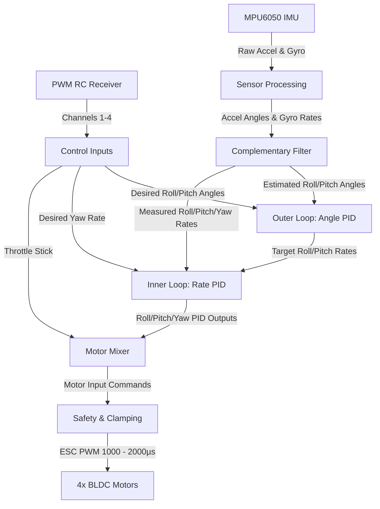

# ☄️ Comet ESP32 Flight Controller

[](https://www.espressif.com/en/products/socs/esp32)
[-orange.svg?style=flat-square&logo=arduino)](https://www.arduino.cc/)
[](#disclaimer--warning)

Comet is a lightweight, high-performance DIY flight controller firmware for **ESP32-based quadcopters** utilizing brushless DC (BLDC) motors and the **MPU6050 IMU**. It implements a dual-loop (cascaded) PID controller, complementary filter attitude estimation, and interrupt-driven PWM receiver channel reading to achieve stable, responsive flight in an X-configuration.

---

## ⚠️ Disclaimer & Warning

> [!WARNING]
> This flight controller code is an **experimental DIY project** and is **NOT** as stable, reliable, or fully tested as commercial flight controller firmware (such as Betaflight, INAV, ArduPilot, or PX4).
> 
> **Use this code completely at your own risk.** The developer is NOT responsible for:
> - Drone crashes or flyaways
> - Hardware or property damage
> - Personal injuries or accidents
> - Any loss caused by using this code
> 
> **Safe Testing Practices:**
> 1. 🛑 **Always remove the propellers** before connecting the battery or flashing new code on the bench.
> 2. Perform initial ground testing with the quadcopter secured or tethered.
> 3. Fly only in wide, open outdoor areas away from people, animals, and obstacles.

---

## 🚀 Key Features

* **Dual-Loop (Cascaded) PID Controller:** 
  * **Outer Loop:** Controls attitude angles (Roll and Pitch) to provide self-leveling stabilization.
  * **Inner Loop:** Controls angular rates (Roll, Pitch, and Yaw) to achieve precise dynamic response.
* **Sensor Fusion:** Complementary filter combining accelerometer tilt estimations with integrated gyroscope angular rates for low-latency, drift-free attitude estimation.
* **Low-Latency Interrupt Handlers:** Pin Change Interrupts track up to 6 PWM channels from an RC receiver in microsecond resolution, bypassing blocking code.
* **High Refresh Rate ESC Support:** Drives 4 brushless ESCs using the `ESP32Servo` library at a dedicated **500Hz refresh rate** for fast motor corrections.
* **Quadcopter X-Mixer:** Converts roll, pitch, yaw, and throttle inputs into control signals for a standard X-configuration frame.
* **Safety Fail-safes:**
  * **Throttle Cut-off:** Disarms motors and resets all PID Integrator terms when the throttle stick falls below a threshold (1030µs) to prevent ground flyaways and I-term windup.
  * **Angle Limiter:** Clamps complementary filter output and stick angle demands to $\pm 20^\circ$ for controllable flight.
  * **Output Clamping:** Keeps motor commands strictly between idle (1170µs) and maximum (1999µs) output limits.
* **Calibration Utility:** Dedicated script (`Gyro_accelerometer_calibration.ino`) for computing precise accelerometer and gyroscope offsets.

---

## 📋 Pin Mapping Configuration

The firmware is pre-configured to use the following ESP32 pins:

### 1. Motors (ESC PWM Output)
| Motor | Position & Spin | ESP32 GPIO Pin |
|---|---|---|
| **Motor 1** | Front Right (Counter-Clockwise - CCW) | `GPIO 13` |
| **Motor 2** | Rear Right (Clockwise - CW) | `GPIO 12` |
| **Motor 3** | Rear Left (Counter-Clockwise - CCW) | `GPIO 14` |
| **Motor 4** | Front Left (Clockwise - CW) | `GPIO 27` |

### 2. RC Receiver Input (PWM Channels)
| Channel | Control | ESP32 GPIO Pin |
|---|---|---|
| **Channel 1** | Roll (Aileron) | `GPIO 34` |
| **Channel 2** | Pitch (Elevator) | `GPIO 35` |
| **Channel 3** | Throttle | `GPIO 32` |
| **Channel 4** | Yaw (Rudder) | `GPIO 33` |
| **Channel 5** | AUX 1 | `GPIO 25` |
| **Channel 6** | AUX 2 | `GPIO 26` |

### 3. MPU6050 IMU & Peripherals
| Device / Function | Pin Name | ESP32 GPIO Pin |
|---|---|---|
| **I2C SDA** | MPU6050 Data | `GPIO 21` (Default ESP32 SDA) |
| **I2C SCL** | MPU6050 Clock | `GPIO 22` (Default ESP32 SCL) |
| **Status LED** | Indication LED | `GPIO 15` |

---

## 📐 System Architecture

The control loop runs deterministically at $250\text{ Hz}$ ($t = 0.004\text{ s}$ loop time). The diagram below illustrates how inputs are read, filtered, processed through the cascaded PID control loop, and mixed into motor commands:



---

## 🛠️ Calibration Procedure

Before attempting your first flight, you **must** calibrate the MPU6050 IMU offsets to ensure the flight controller knows what "flat" is.

1. **Flash Calibration Sketch:**
   Open and upload `Gyro_accelerometer_calibration.ino` to your ESP32.
2. **Mount Setup:**
   Place the quadcopter on a completely level, vibration-free surface.
3. **Execute Calibration:**
   * Open the Serial Monitor at **115200 baud**.
   * Press `Space bar` and then `Enter` to initiate the calibration sequence.
   * The program will collect 2000 samples to average out the sensor noise and calculate the offsets.
4. **Copy Output Offsets:**
   The calibration sketch will output formatted calibration variables to the serial console, for example:
   ```cpp
   RateCalibrationRoll = 0.27;
   RateCalibrationPitch = -0.85;
   RateCalibrationYaw = -2.09;
   AccXCalibration = 0.03;
   AccYCalibration = 0.01;
   AccZCalibration = -0.07;
   ```
5. **Apply Offsets:**
   Open the main flight controller file `Comet_ESP32_flightcontroller.ino`, navigate to `setup()` (around lines 223–228), and replace the hardcoded values with your newly measured values.

---

## ⚙️ PID Constants & Tuning

PID parameters can be tuned directly inside `Comet_ESP32_flightcontroller.ino` based on your frame size, motor thrust, and weight:

```cpp
// Outer Loop: Angle PID (Roll / Pitch)
float PAngleRoll = 2.0;    
float IAngleRoll = 0.5;    
float DAngleRoll = 0.007;   

// Inner Loop: Rate PID (Roll / Pitch)
float PRateRoll = 0.625;   
float IRateRoll = 2.1;     
float DRateRoll = 0.0088;  

// Yaw PID (Rate Loop only)
float PRateYaw = 4.0;      
float IRateYaw = 3.0;      
float DRateYaw = 0.0;      
```

> [!TIP]
> * **Acro / Rate Mode:** The yaw axis only utilizes the rate control loop.
> * **Self-Leveling Mode:** Roll and pitch use the angle PID outputs as the reference inputs for the rate PID loop.

---

## 💻 Software Prerequisites & Libraries

To compile and upload this project, ensure your Arduino IDE is set up with:
1. **ESP32 Board Package:** Install the official Espressif board package via the Arduino Board Manager.
2. **ESP32Servo Library:** Install the **ESP32Servo** library by Kevin Harrington (available in the Arduino Library Manager) to generate high-frequency PWM servo signals.
3. **Wire Library:** (Built-in) used for I2C communication.

---

## 🛠️ Code Structure

* **[Comet_ESP32_flightcontroller.ino](file:///c:/Users/Sham/Downloads/ESP32-custom-Flight-controller-BLDC-main/ESP32-custom-Flight-controller-BLDC-main/Comet_ESP32_flightcontroller.ino)**: Core flight control loop. Handles sensor polling, receiver decoding, cascading PIDs, motor mixing, safety fail-safes, and serial debugging output.
* **[Gyro_accelerometer_calibration.ino](file:///c:/Users/Sham/Downloads/ESP32-custom-Flight-controller-BLDC-main/ESP32-custom-Flight-controller-BLDC-main/Gyro_accelerometer_calibration.ino)**: Calibration utility script to determine accelerometer and gyroscope biases.
